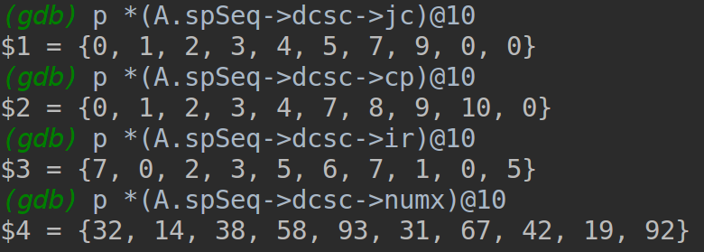

## Clion debug

### Config project in CLion

You just need gcc and openmpi in your system, and system supports cmake, then you can just open a project in CLion.

### Debug settings

You should disable optimizations for compiler, the automatic optimization will confuse a lot when debugging. In addition, open gdb will give you a lot of information needed for debugging.

Can just add following line in `CMakeLists.txt` under base directory.

`set(CMAKE_CXX_FLAGS_DEBUG "-std=c++11 -std=c++14 -fopenmp -fPIC -O0 -g3 -ggdb")`

We just set these flags when debugging, when releasing we want all the optimizations.

### Core class definition

#### testing definition

```
typedef SpDCCols<int, NT> DCCols;
typedef SpParMat<int, NT, DCCols> MPI_DCCols;
```

We defined a type named `DCCols` which shows a column type, so here matrix is column-based( **?** ).

Sparse Matrix :

```
A (type : PSpMat<int>::MPI_DCCols)
|
|___CommGrid
|
|___sqSeq(type : SpDCCols<int, int> *)
    |
    |___m, n, nnz
    |
    |___dcsc/dcscarr : values pointers
```

Vector :

```
arr (type : std::vector<int>)
```

### Sparse matrix storage

Original data in `TESTDATA/gen_10_10_10.txt`:

`m = 10; n = 10; nnz = 10`

|row|col|val|
|:-:|:-:|:-:|
|7	|5	|31|
|1	|8	|19|
|8	|5  |67|
|6	|10 |92|
|2	|6	|42|
|1	|2	|14|
|4	|4	|58|
|8	|1	|32|
|6	|5	|93|
|3	|3	|38|


In source code, `dcsc` contains following four terms:

```
IT * cp;		//!<  The master array, size nzc+1 (keeps column pointers)
IT * jc;		//!<  col indices, size nzc (non-zero columns)
IT * ir;		//!<  row indices, size nz
NT * numx;		//!<  generic values, size nz
```

In debugging, the values of above four terms are:



- the values(`numx`) is sorted by their columns

- `ir` shows the corresponding row index of the value in `numx`

- `jr` size is actually 8, `cp` size is actually 9, it's correct, because after max size the values is 0

- `ir` and `jr` are `0-based`, means that you should `-1` in original data

- how can we know a value's position in matrix under this storage setting:

    |val|col(`jc`)|row(`ir`)|
    |:-:|:-:|:-:|
    |32	|0	|7  |
    |14	|1	|0  |
    |38	|2  |2  |
    |58	|3  |3  |
    |93	|4	|5  |
    |31	|4	|6  |
    |67	|4	|7  |
    |42	|5	|1  |
    |19	|7	|0  |
    |92	|9	|5  |

(**?**)For a `k`th value in `numx`, determinate its row is easy, just return `ir[k]`;
we can find its column by `jc[cp[indexOf(<= k)]]`, `cp[indexOf(<= k)]` means the index in `cp` and the value there is exact small or equal to `k`.
