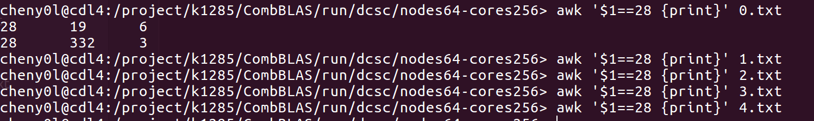
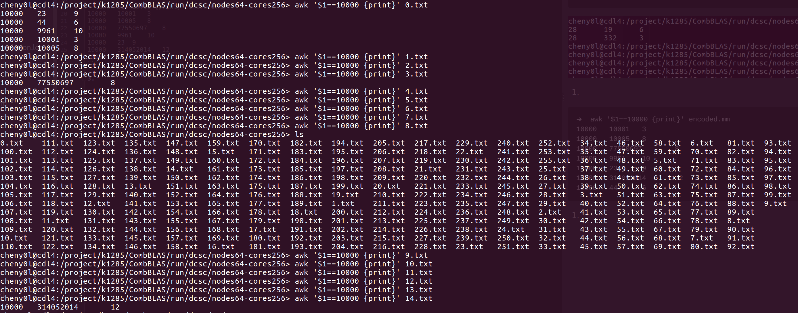
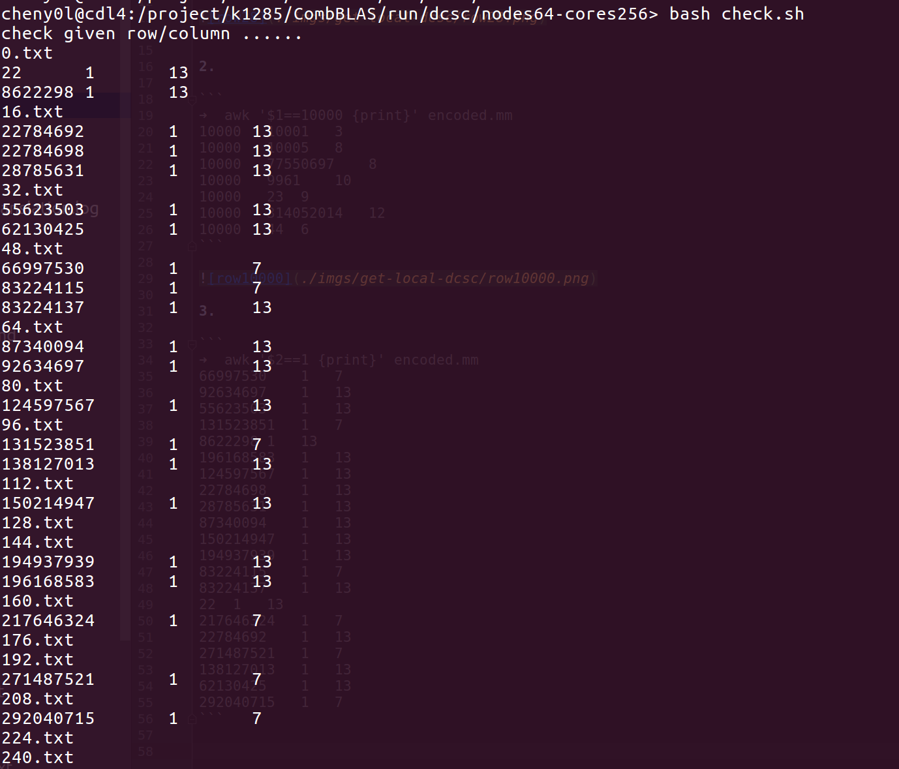

## Get Local DCSC Experiments

#### lubm10240 (nodes64, cores256)

1. 

```
➜  awk '$1==28 {print}' encoded.mm 
28	19	6
28	332	3
```




2. 

```
➜  awk '$1==10000 {print}' encoded.mm
10000	10001	3
10000	10005	8
10000	77550697	8
10000	9961	10
10000	23	9
10000	314052014	12
10000	44	6
```



3. 

```
➜  awk '$2==1 {print}' encoded.mm 
66997530	1	7
92634697	1	13
55623503	1	13
131523851	1	7
8622298	1	13
196168583	1	13
124597567	1	13
22784698	1	13
28785631	1	13
87340094	1	13
150214947	1	13
194937939	1	13
83224115	1	7
83224137	1	13
22	1	13
217646324	1	7
22784692	1	13
271487521	1	7
138127013	1	13
62130425	1	13
292040715	1	7
```


