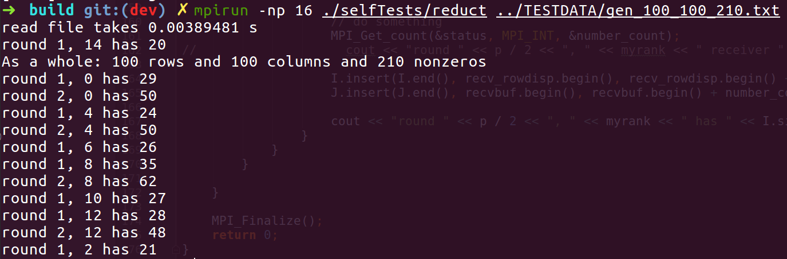

## MPI reduction

### reduction result

1. test file
    
    TESTDATA/gen_100_100_210.txt
    
    size : 100 * 100
    
    nnz : 210

2. 16 processes

3. local nnz :

```
0, 10
1, 19
2, 11
3, 10
4, 16
5, 8
6, 16
7, 10
8, 19
9, 16
10, 18
11, 9
12, 16
13, 12
14, 7
15, 13
```

4. after reduction (round 2)



```
0, 50
4, 50
8, 62
12,48
```

### reduction on shaheen (nodes = 16, cores = 256)

[reduct-result](./reduct-lubm10240-nodes16-cores256.log)