## Optimization

### time counting

Count every time-consuming operation's time

On local machine for `lubm320` (`seconds`) :

|#cpus|read|transpose|diagonalize|mmul_scalar|mult1|mult2|mult3|
|:---:|:---:|:------:|:---------:|:---------:|:---:|:---:|:---:|
|1|26.7711|4.9926|1.33919|0.00956011|34.2618|24.7655|23.8303|
|4|8.69744|3.32247|0.464876|0.00810003|21.0941|17.1692|17.2551|
|9|5.12301|2.28991|0.306377|0.00640297|14.7628|12.3927|12.8212|
|16|3.34099|1.67104|0.300932|0.0211461|11.5028|11.2116|11.2944|

On shaheen for `lubm320` :

|#cpus|read|transpose|diagonalize|mmul_scalar|mult1|mult2|mult3|mult4
|:---:|:---:|:---:|:------:|:---------:|:---------:|:---:|:---:|:---:|
|1|18.4917|4.53407|0.936716|0.00710201|31.9158|20.8185|20.9708|26.526
|4|7.08761|2.94892|0.395772|0.00937915|20.5853|15.1667|15.3763|18.2991
|9|4.71866|2.10425|0.393895|0.00629616|14.5807|10.4692|10.6399|12.8676
|16|3.35191|1.66142|0.407506|0.00605702|11.9182|10.009|10.0004|10.3026
|25|3.23502|1.34843|0.390964|0.057848|9.9501|11.0779|11.0623|8.73992
|36|2.73605|1.20657|0.257613|0.126572|10.1898|13.2729|14.2806|7.56138
|49|2.33239|1.17811|0.50219|0.11552|9.46852|18.7517|19.0659|8.83109
|64|2.017|1.02768|0.304152|0.00444198|8.88377|9.79513|9.69101|7.74233
|81|1.54248|0.651624|0.417036|0.199775|6.16243|17.031|17.0951|5.98854
|100|1.41879|0.567337|0.582329|0.124534|6.45697|22.0872|22.627|5.95553
|121|1.50431|0.661743|0.330357|0.339586|6.2319|30.1802|29.4875|5.7122
|144|1.27905|0.607804|0.212355|0.253805|5.42147|25.3309|24.9407|4.78537
|169|1.21503|0.426037|0.475513|0.26645|5.28963|32.7779|32.5837|4.78651
|196|1.25083|0.493142|0.212052|0.245513|4.1898|29.5947|28.7673|4.29788
|225|1.17258|0.384518|0.463956|0.230272|4.43623|36.784|36.3703|4.06421
|256|0.994052|0.433257|0.182763|0.00197196|4.36241|5.53596|5.42882|3.96547
|289|1.12493|0.389906|0.19313|0.268711|3.74618|41.9235|42.2357|3.82539
|324|0.928288|0.282568|0.235378|0.352991|3.8067|41.2056|41.3756|3.51883
|361|1.06114|0.345324|0.237742|0.367672|3.81319|49.0681|49.0395|3.58342
|400|0.995261|0.250652|0.234812|0.335142|3.64227|48.455|48.1974|3.14777

mult1 : Mult_AnXBn_DoubleBuff

mult2 : PspGEMM

mult3 : Mult_AnXBn_Synch

mult4 : Square

From above table, usually Mult_AnXBn_DoubleBuff can scale well for `lubm320`, but for small number of tasks,
PspGEMM and Mult_AnXBn_Synch are better than Mult_AnXBn_DoubleBuff. Usually, PspGEMM and Mult_AnXBn_Synch have similar performance.
I think the reason is communication cost, for this data, when we increase number of cpus, program spends a lot of time on communication.  

### time counting for lubm320_L2

~~Based on time scalability above, I chose `Mult_AnXBn_DoubleBuff` to do multiplication.
Following results are all based on this assumption.~~

First I used `PspGEMM` as multiplication function,

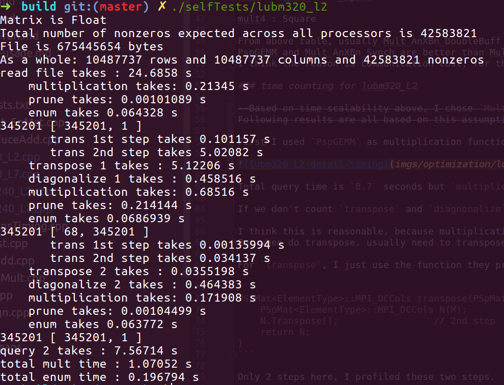

Total query time is  dominated by **`transpose` step**, but `multiplication` and `prune` don't cost much.

If we don't count `transpose` and `diagnonalize` time, then actually query time is similar to the time on the paper
(It also holds for query 7).

I think this is reasonable, because multiplication for real query is not very complicated, some matrix only contains exactly `1` entry.
But when do transpose, usually need to transpose a complex matrix.

For `transpose`, I just use the function they provided,

```
PSpMat<ElementType>::MPI_DCCols transpose(PSpMat<ElementType>::MPI_DCCols &M) {
    PSpMat<ElementType>::MPI_DCCols N(M);       // 1st step
    N.Transpose();                 // 2nd step
    return N;
}
```

Only 2 steps here, I profiled these two steps.

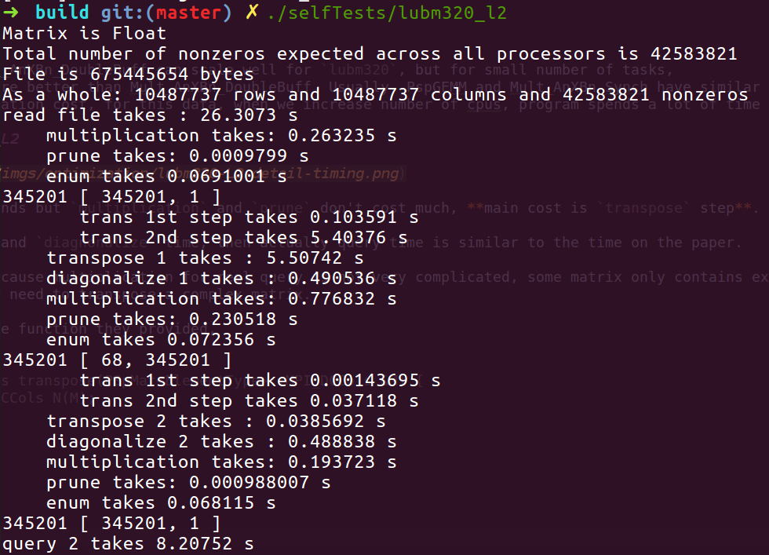

So the second step `N.Transpose()` costs much, and `Transpose` is internal function.

### PspGEMM v.s. Mult_AnXBn_DoubleBuff

For query 2 : 

PspGEMM | Mult_AnXBn_DoubleBuff
:-------------------------:|:-------------------------:
|
|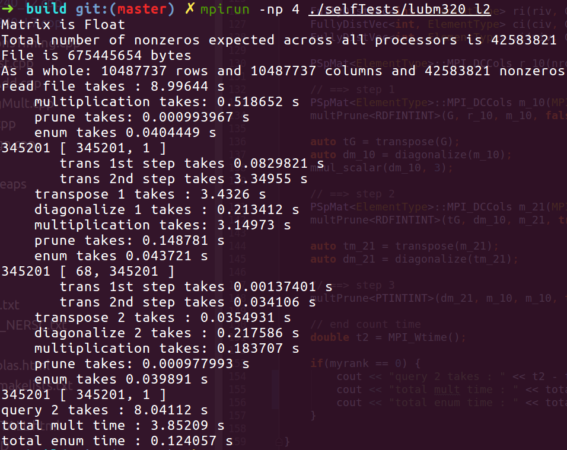
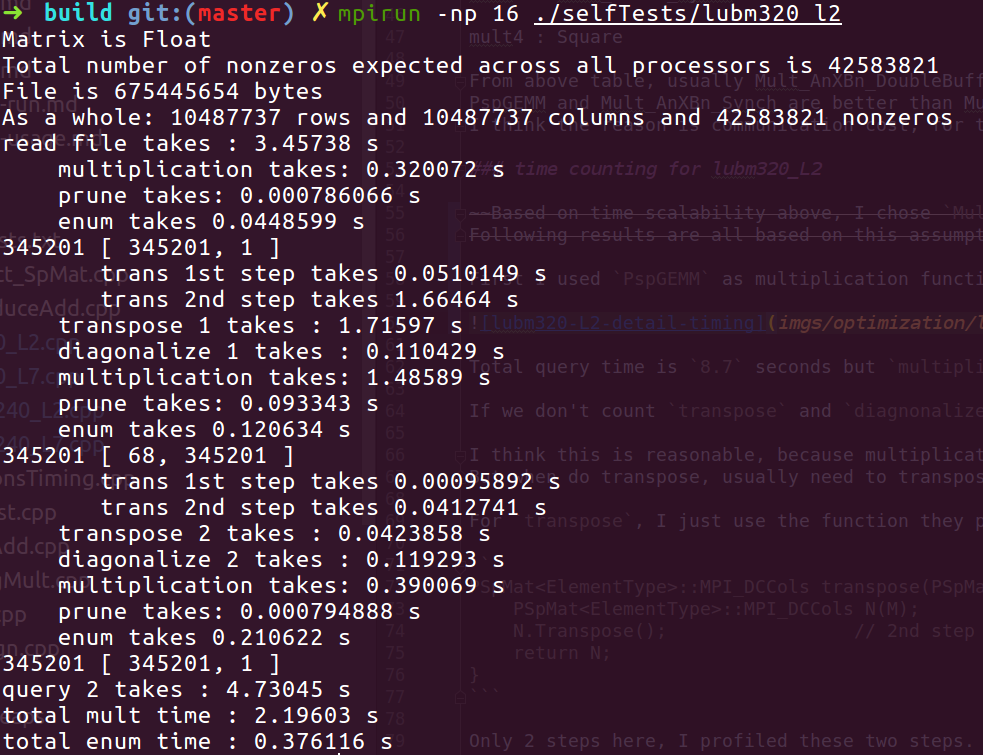|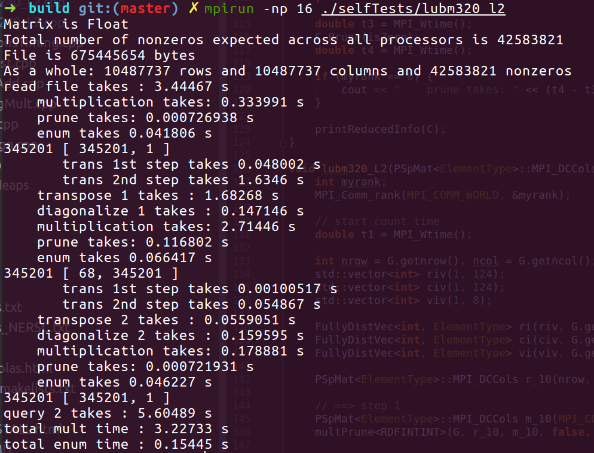

For query 7 :

PspGEMM | Mult_AnXBn_DoubleBuff
:-------------------------:|:-------------------------:
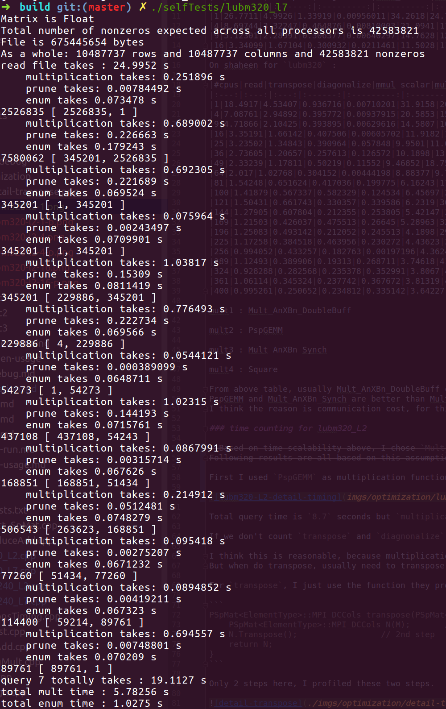|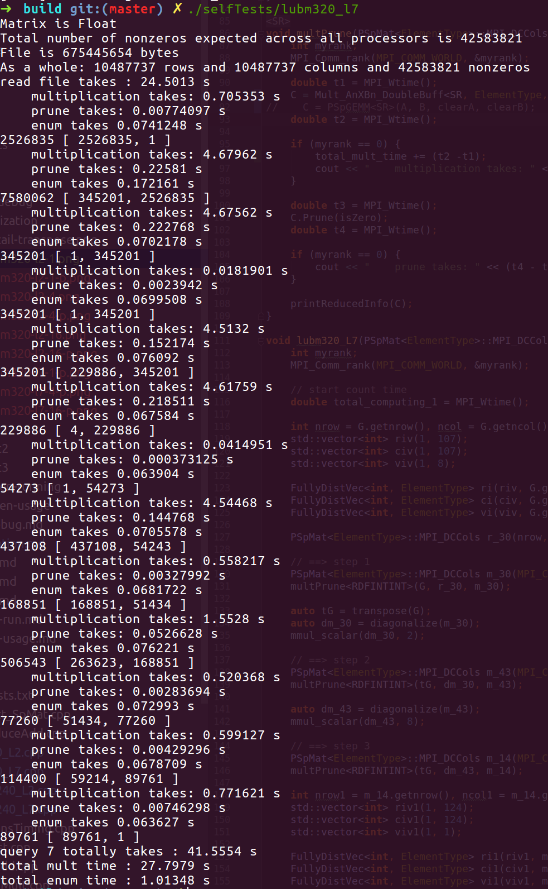
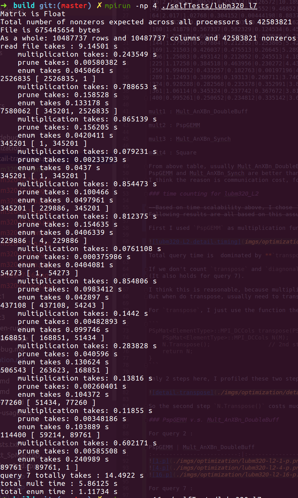|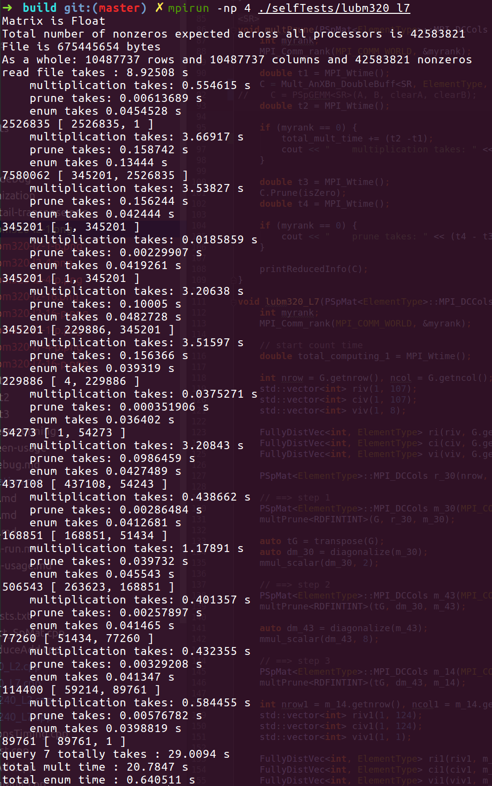
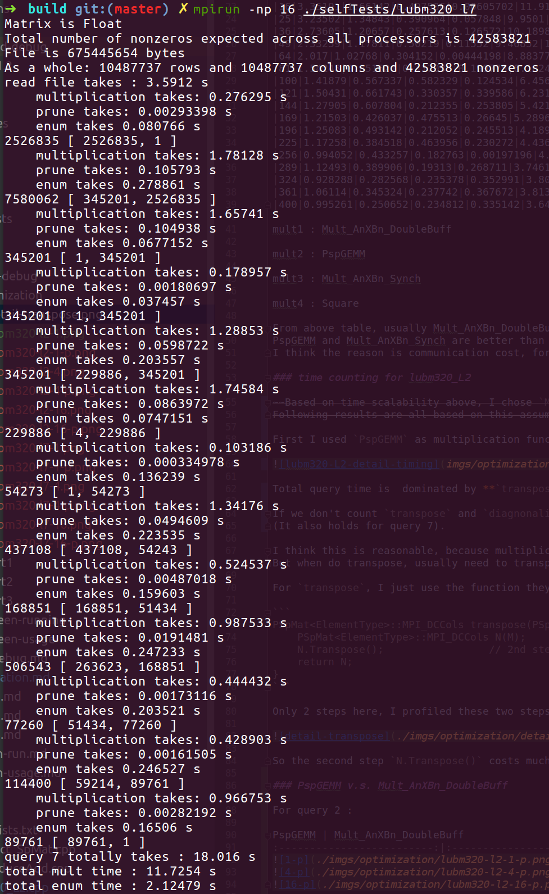|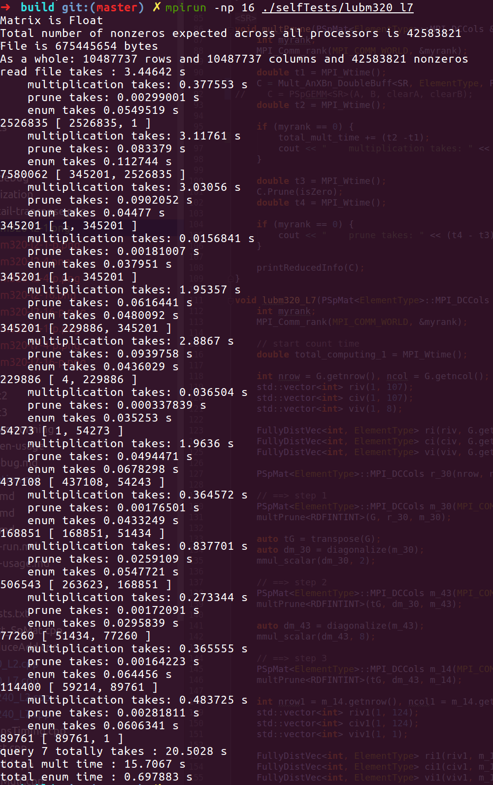

### Different #nodes on Shaheen

Use `Mult_AnXBn_DoubleBuff`

lubm10240_l2 :

|#nodes|total_query_time (s)|
|:----:|:------------------:|
1|      330.158 
4|      118.146 
16|     132.597 
64|     88.5528 
256|    64.5638 
1024|   35.4126 

lubm10240_l7 :

|#nodes|total_query_time (s)|
|:----:|:------------------:|
4|      381.628 
16|     423.329 
64|     284.113 
256|    214.657 
1024|   122.162 


