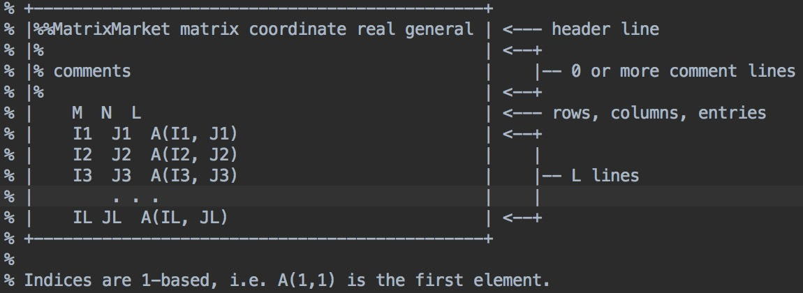
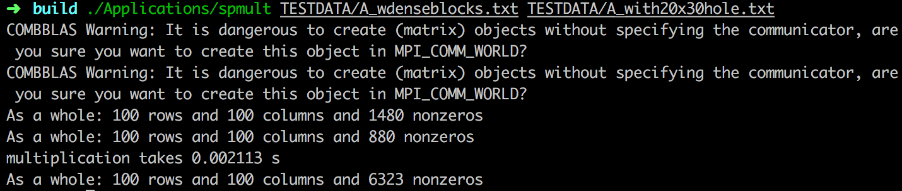

## Report 1 : Get Started with Comb_BLAS

#### Installation

   Dependencies : gcc, mpi

   Steps :

   - `cd CombBLAS_beta_16_1`
   - `mkdir build`
   - `cd build`
   - `cmake ..`
   - `make -j4`
   - `ctest -V` (need test inputs for testing)

#### Basics

   

   TESTDATA contains some test input data, download and put it in build folder

   Use `TESTDATA/A_wdenseblocks.txt` and `TESTDATA/A_with20x30hole.txt` for multiplication

#### Add a test based on Comb_BLAS

   - add a cpp file in Applications (or ReleaseTests)
   - add two lines in CMakeLists.txt in Applications (or ReleaseTests) folder

        `ADD_EXECUTABLE( spmult SpMult.cpp )`

        `TARGET_LINK_LIBRARIES( spmult CommGridlib MPITypelib MemoryPoollib Hashlib mmiolib)`
   - run `make -j4` in build folder
   - run `./Applications/spmult TESTDATA/A_wdenseblocks.txt TESTDATA/A_with20x30hole.txt` in build folder

#### Result

   
