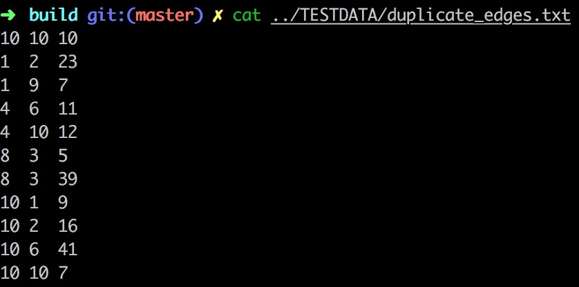
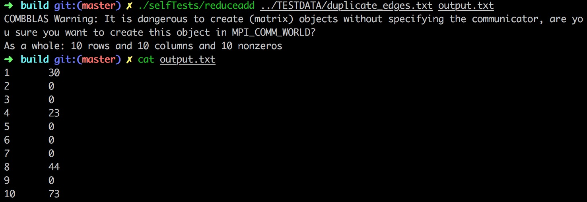
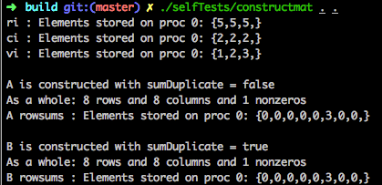
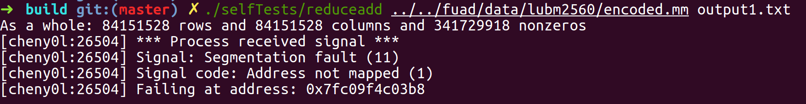
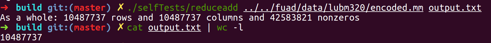
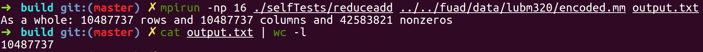
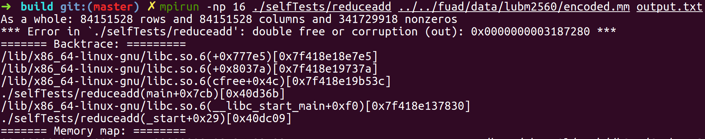

## Report 2 : Basic functions implementation in Comb_BLAS

### Task description

Please do the following task before moving on to the tasks below:

0. Write a program that takes a matrix in matrix market format as an input and adds the elements in each row and writes the resulting vector to disk (a reduction with the ADD operator along the rows).

I have produced some example matrices in /home/cheny0l/work/db245/fuad/data/ on your machine to test this program with.
I will call your program as follows:

`mpirun -np 16 row_reduce_yan input_matrix output_path`

The following are to be done using CombBLAS functions

1. Write a function set_element(M, i, j, v) that takes a matrix M and sets M(i, j) to v

2. Write a function mmul_scalar(M, s) that multiplies matrix M with scalar s

3. write a function diagonalize(M) that does a reduction along each row with the OR operator and places the resulting vector on the diagonal of M

4. write a function transpose(M) that transposes M

### Environment change log

I put all my tests in `selfTests` folder, so the executable files will be `build/selfTests`.

For example, if you want to run the `spmult`, you can :

```
cd build

./selfTests/spmult mat1.file mat2.file
```

In addition, `TESTDATA` is in the project home directory, previous it's in `build`, and I remove the tracking for `build` directory in git.

External test data is in `../fuad/data`

### Generate matrix market by yourself

I wrote a script to generate a matrix file, it locates in `TESTDATA` folder, and you should first go to that folder

`cd TESTDATA`

Then run the command :

`julia create_mm.jl m n nnz`

you should specify `m`, `n` and `nnz`, and you will get a txt file named as `gen_m_n_nnz.txt`.

We can generate any dimensions for test, it is convenient.

### Task 0 : reduce add

Basically call the internal `Reduce` function is fine, some problems and issues should be considered :

* In matrix market format, index should start from 1 not 0

    ---> Why this matters? Because there is a `delete []` in the `Reduce`, if real data starts from 0, there will be an index is outside the array bound, which is terrible.

* **?** Duplicate edges between same vertex pair are not supported

    ---> I created a simple matrix market format file that has duplicate edge (`TESTDATA/duplicate_edges.txt`), file content :

    

    Duplicate position is `8 3`

    Sparse matrix construction from reading file is fine with no errors. Apply `reduceadd` to that matrix, result :

    

    Two things should be mentioned in this result :

    1. Matrix construction will treat duplicate edges as different edges, because they has `10` non-zeros (probably because the sparse matrix storage is different from the normal matrix array storage)

    2. ReduceAdd can work correctly in this case, row `8` has correct summation.

    In addition, I tried to construct sparse matrix from scratch (pre-define dimension and non-zero positions and values). The code file is `selfTests/Construct_SpMat.cpp`. The result is :

    

    (Basically the construction from code is correct, you set `sumDuplicate` and get `sum` of duplicate values)

### ReduceAdd on lubm data

#### Without setting mpi #procs

When I ran test on `lubm2560` and `lubm10240` dataset, error occurred,



But I got result without errors with `lubm320` data,



dimension (#rows = #columns) of three data :

|lubm320|lubm2560|lubm10240|
|:-----:|:------:|:-------:|
|10487737|84151528|336506397|

I doubt if is the size problem, of course a debug about `Reduce` function is needed.

#### Setting mpi #procs = 16





The problem here is about `double free or corruption`, without setting mpi, the error is `address not mapped`.

All errors are because the start index is 0 not 1, I generated some matrixes myself and passed the test for both cases.

`scale_test.sh` in `TESTDATA` can automatically generate different nnz matrix for testing, I fixed dimension with `80000000 * 80000000`, change nnz from `150000000` to `300000000`, everything is okay. Then I generated an example with the same size with largest lubm data and same nnz.
