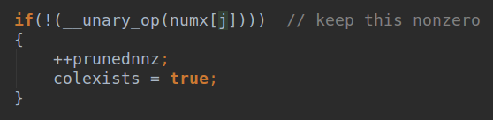
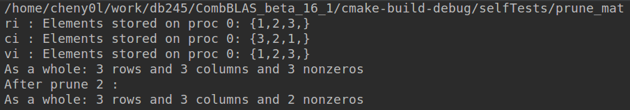
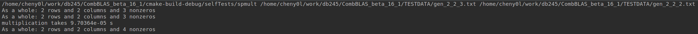
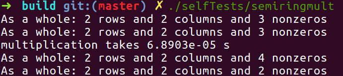
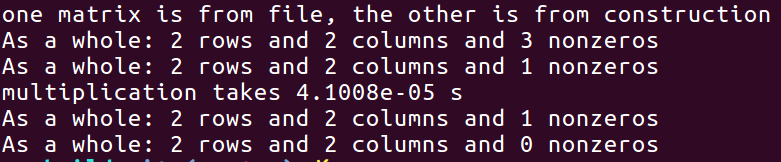
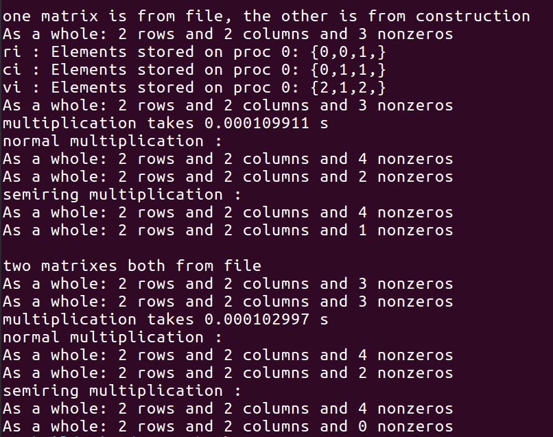

## Report 3 : Real operation with CombBLAS

### Task Description

1. Implement a semiring multiplication in CombBLAS. 

This a multiplication where you define the 'addition' operator and 'multiplication' operator. 
Our addition operator is going to be logical OR (just like in the reduction assignment), 
and the multiplication operator is iseq, which a function that returns 1 only if both operands are non-zero, and they are equal. 
Example: 0 iseq 0 = 0, 0 iseq 1 = 0, 0 iseq 5 = 0, 3 iseq 5 = 0, 5 iseq 5 = 1.
Please test this multiplication in any way you see fit with small matrices. 

2. Real graph operation

- query 2

```
m_(1, 0) = G × {1@(125,125)}*8
m_(2, 1) = G.T() × m_(1, 0).D() * 3
m_(1, 0) = m_(2, 1).T().D() * m_(1, 0)
```

- query 7

```
m_(3, 0) = G × {1@(108, 108)}*8
m_(4, 3) = G.T() × m_(3, 0).D()*2
m_(1, 4) = G.T() × m_(4, 3).D()*8
m_(1, 4) = {1@(125, 125)} * m_(1, 4)
m_(5, 4) = G × m_(1, 4).T().D()*11
m_(2, 5) = G.T() × m_(5, 4).D()*8
m_(2, 5) = {1@(2080, 2080)} * m_(2, 5)
m_(6, 5) = G × m_(2, 5).T().D()*7
m_(6, 5) = m_(4, 3).T().D() * m_(6, 5)
m_(4, 3) = m_(4, 3) × m_(6, 5).D()
m_(5, 4) = m_(6, 5).T().D() * m_(5, 4)
m_(4, 3) = m_(5, 4).T().D() * m_(4, 3)
m_(3, 0) = m_(4, 3).T().D() * m_(3, 0)
```

### Self-Defined Multiplication (Semiring Multiplication)

`include/ParFriends.h` defines some matrix-matrix matrix-vector operation, especially multiplication(`Mult_AnXBn_DoubleBuff`).

`SpParMat< IU, NUO, UDERO > combblas::Mult_AnXBn_DoubleBuff(SpParMat< IU, NU1, UDERA > &A, SpParMat< IU, NU2, UDERB > &B, bool clearA=false, bool clearB=false)`

This function accepts two sparse matrix and return their multiplication result, 
`clearA/B` can clear input matrix after multiplication.

~~Basically, I can't just take semiring multiplication operators as input and get a new multiplication function,
it's not allowed here. However, **All functions in `ParFriends.h` are friend functions to matrix and vector, 
I can create a new friend multiplication function whose only difference with `Mult_AnXBn_DoubleBuff` is basic operators.**~~

~~First, need to know what's inside the `Mult_AnXBn_DoubleBuff` function.~~

There is a file named `Semirings.h`, inside that file there are some semiring definitions.
I can just define a new semiring for my own application, and construct a new type, 
then give it to real matrix multiplication.

```
    template < class T1, class T2 >
    struct RDFRing {
        typedef typename promote_trait<T1, T2>::T_promote T_promote;

        static T_promote id() { return 0; }

        static bool returnedSAID() { return false; }

        static MPI_Op mpi_op() { return MPI_SUM; };

        static T_promote add(const T_promote &arg1, const T_promote &arg2) {
            if (arg1 | arg2)
                return static_cast<T_promote>(1);
            else
                return static_cast<T_promote>(0);
        }

        static T_promote multiply(const T1 &arg1, const T2 &arg2) {
            if (arg1 != 0 && arg2 != 0 && arg1 == arg2)
                return static_cast<T_promote >(1);
            else
                return static_cast<T_promote >(0);
        }

        static void axpy(T1 a, const T2 &x, T_promote &y) {
            y = add(y, multiply(a, x));
        }
    };
```

In our case, only `add` and `multiply` are useful.

#### Clean zeros

I ran a example and actually result is correct, but zero entries still remain in the tuples.
A way to eliminate all zeros is needed.

I found that `Prune` function can prune some specific elements,

`Prune(_UnaryOperation __unary_op, bool inPlace=true)`

About which kind of unary function should be a good one here, in `Prune` implementation,



This means unary function should accept a `NT` value and return a bool value, 
the bool value will determine whether this value will be cleared.

I defined a unary_op which is simple, 

```
bool isZero(ElementType t) {
    return t == 0;
}
```

And then I give to `Prune` function, call `A.Prune(isZero)`, then done.

This is a test to prune elements with value `2` :



I constructed a simple example, which has :

A (read from `TESTDADA/gen_2_2_3.txt`): 

[3 2]

[1 0]

B (read from `TESTDADA/gen_2_2_B.txt`):

[2 1]

[0 2]

With our specific semiring multiplication, the result should be :

C :

[0 1]

[0 1]

Before pruning, the result matrix has `4` nonzeros,



After pruning, 



On local machine, input matrix are located in `TESTDATA` named as `gen_2_2_3.txt` and `gen_2_2_2.txt`,
output matrix is `TESTDATA/test_rdf_semiring.del`

### Query 2

This is an actual query.

A problem occurs when I construct a sparse matrix and multiply it with matrix from file, 
result will always be zero.

For example, 

A (read from `TESTDADA/gen_2_2_3.txt`): 

[3 2]

[1 0]

B (from construction):

[0 0]

[0 2]

Result matrix should have `1` non-zeros, but after pruning, nothing left.



Actually, I don't know why but when I test small matrix multiplication, result is not correct.
I used `TESTDADA/gen_2_2_3.txt` and `TESTDADA/gen_2_2_B.txt` as input and use `Mult_AnXBn_DoubleBuff` as 
the multiplication function, `Mult_AnXBn_Synch` is same actually.



For normal multiplication, result should have `4` non-zeros, but only gets `2`, but no difference whether 
raeding from file or constructing from code.

For semiring multiplication, reading from file gave me correct result, but constructing from code always
returned all zeros.

I'm trying to find out why normal multiplication has a problem......
