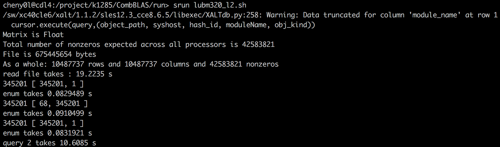
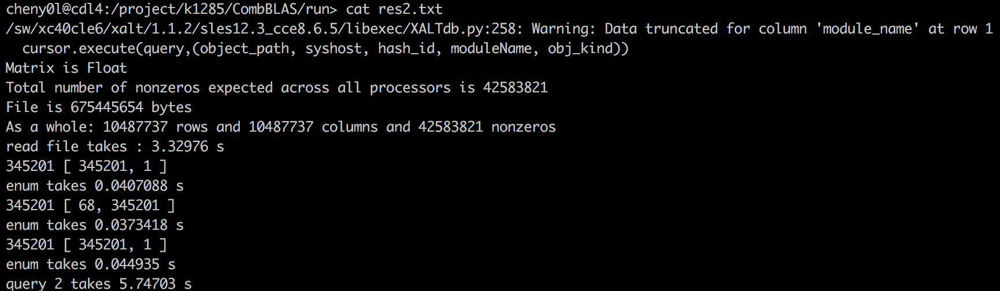
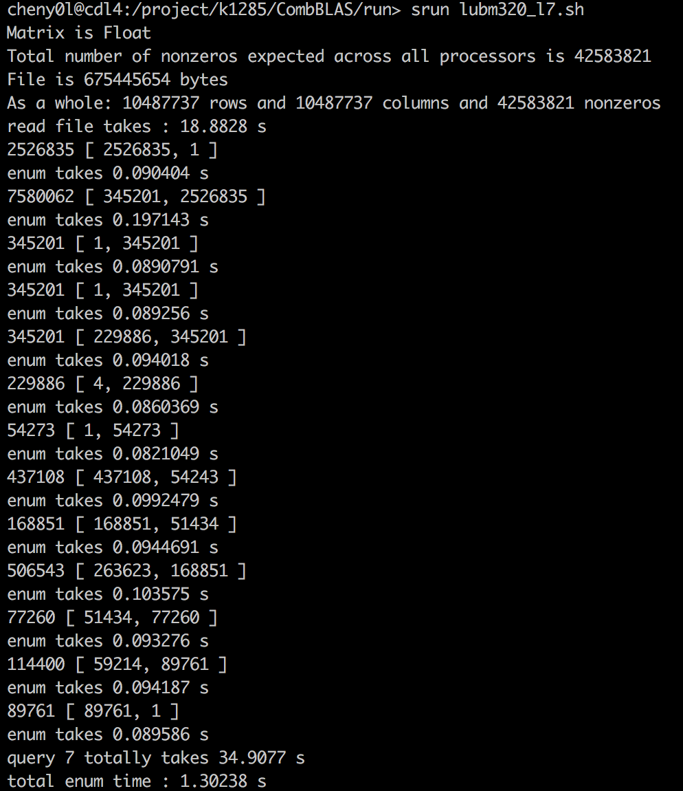
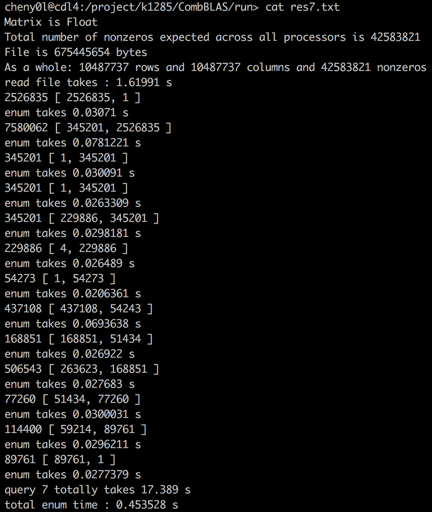

## Running Query on Shaheen

### Compile

On shaheen, should comment all test folders except `selfTests` in `CMakeLists.txt` :

```
# ADD_SUBDIRECTORY( ReleaseTests )
ADD_SUBDIRECTORY( selfTests )
# ADD_SUBDIRECTORY( Applications )
```

First swap modules

`module swap PrgEnv-cray/6.0.4 PrgEnv-gnu`

Maybe need to load `mpich`

`module load cray-mpich`

Then change some configurations in cmake

```
SET(CMAKE_CXX_FLAGS "-I/opt/cray/pe/mpt/7.7.0/gni/mpich-gnu/5.1/include -L/opt/cray/pe/mpt/7.7.0/gni/mpich-gnu/5.1/lib -std=c++11 -std=c++14 -fopenmp -DNDEBUG -w -DGRAPH_GENERATOR_SEQ -O2 -DMPICH_IGNORE_CXX_SEEK")

SET(CMAKE_C_FLAGS "/opt/cray/pe/mpt/7.7.0/gni/mpich-gnu/5.1/include -L/opt/cray/pe/mpt/7.7.0/gni/mpich-gnu/5.1/lib -DNDEBUG -Drestrict=__restrict__ -w -DGRAPH_GENERATOR_SEQ -O2 -DMPICH_IGNORE_CXX_SEEK")

# SET(CMAKE_CXX_FLAGS "-std=c++11 -std=c++14 -fopenmp -DNDEBUG -w -DGRAPH_GENERATOR_SEQ -O2 -DMPICH_IGNORE_CXX_SEEK")

# SET(CMAKE_C_FLAGS "-DNDEBUG -Drestrict=__restrict__ -w -DGRAPH_GENERATOR_SEQ -O2 -DMPICH_IGNORE_CXX_SEEK")
```

Then you can build as usual.

### Running queries

The data path should be changed.

```
// string Mname("/home/cheny0l/work/db245/fuad/data/lubm320/encoded.mm");

string Mname("/project/k1285/fuad/data/lubm320/encoded.mm");
```

After build, set up submit script (following example is for `lubm320_l7.sh`)

```
#!/bin/bash
#
#SBATCH --job-name=lubm320_l7
#SBATCH --output=res_lubm320_l7.txt
#SBATCH --partition=workq
#SBATCH --ntasks=100
#SBATCH --time=00:01:00
#SBATCH --mem-per-cpu=100

srun /project/k1285/CombBLAS/build/selfTests/lubm320_l7
```

Submit it

`sbatch lubm320_l7.sh`

### Results

#### L2

1 process :



16 processes :



#### L7

1 process :



100 processes (I used 16 processes but got `memory full` error) :


