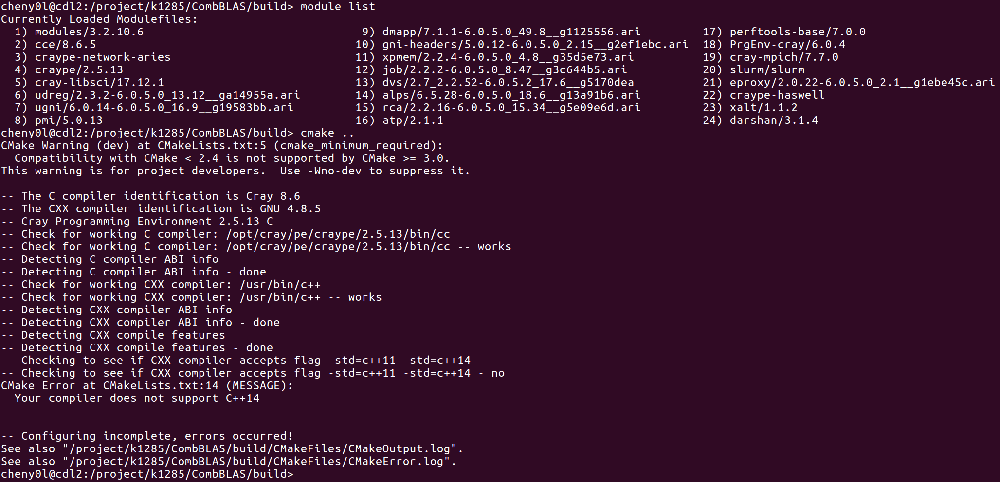
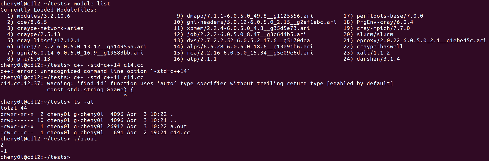
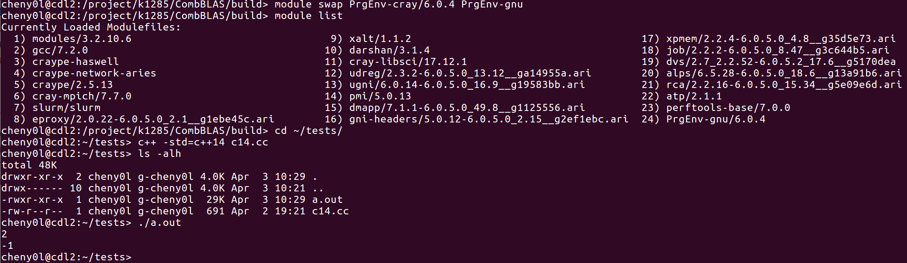
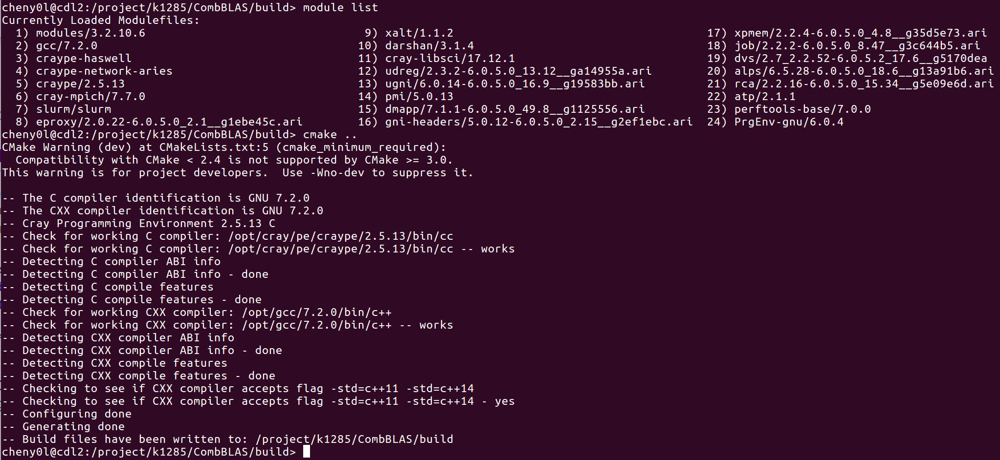
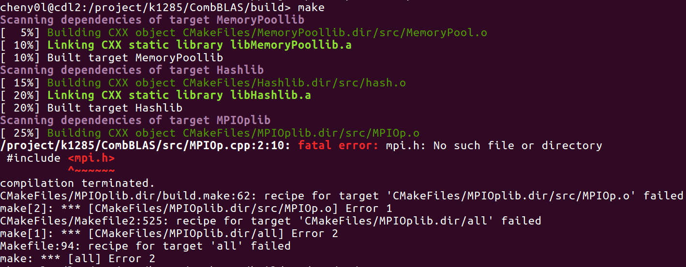
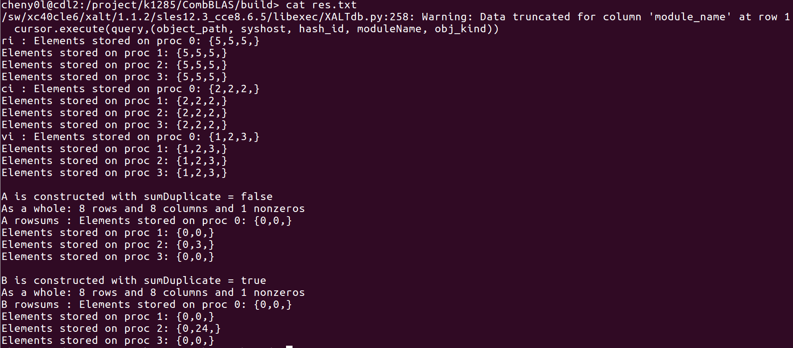
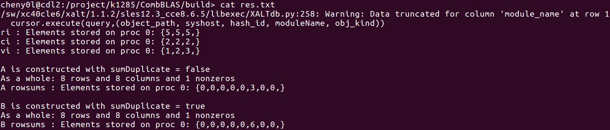
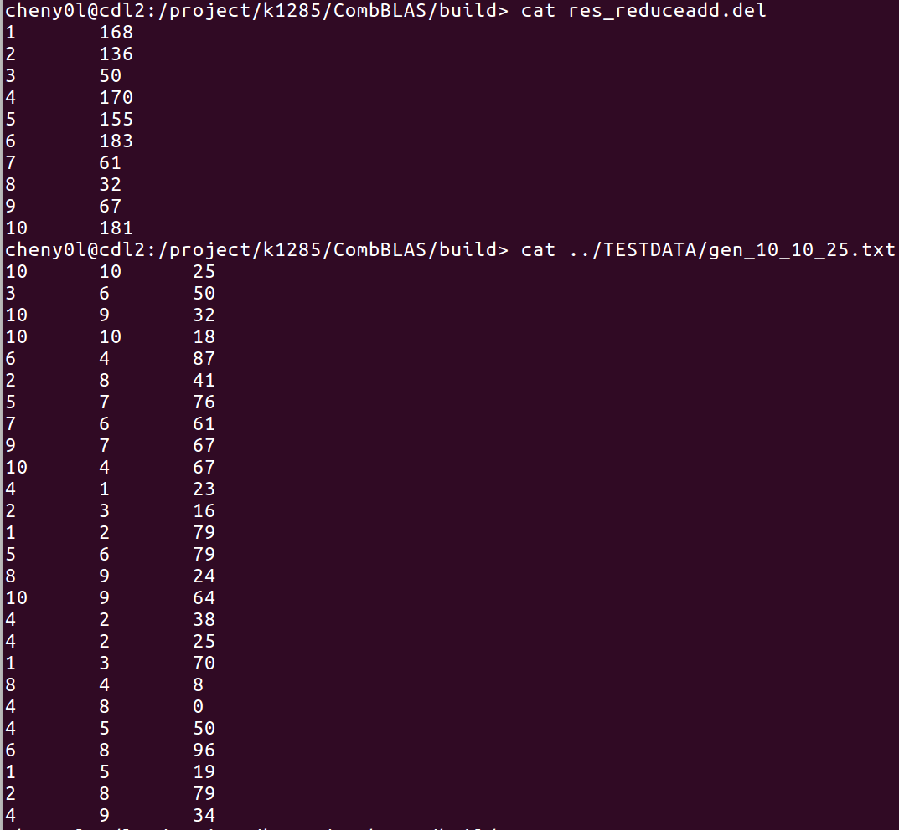

## Shaheen

#### Login

Need password and a OATH, got it from https://www.hpc.kaust.edu.sa/user/login

Actually it doesn't matter you login from other ip addresses, just need OATH

#### Basic observations

Shaheen : SUSE Linux

`Linux cdl3 4.4.103-6.38-default #1 SMP Mon Dec 25 20:44:33 UTC 2017 (e4b9067) x86_64 x86_64 x86_64 GNU/Linux`

- what Shaheen has :

    * gcc ( 4.8.5 )

    * docker ( 17.06.0-ce )

- whst Shaheen doesn't have :

    * mpi compiler (mpicc)

You can write mpi program, but can not use `mpicc` / `mpirun` commands.

~~Need to use container to run the CombBLAS~~

#### How to do things without sudo in remote server

[Linuxbrew](http://linuxbrew.sh/) is a good solution for you

1. installation : execute following script

    `sh -c "$(curl -fsSL https://raw.githubusercontent.com/Linuxbrew/install/master/install.sh)"`

2. configuration : add this to `$HOME/.bashrc`

    `export PATH=$PATH:$HOME/.linuxbrew/bin`

3. test : install a simple library

    `brew install hello`

    `hello` --> output : Hello, World!

*Drawback : installation is slow on Shaheen*

4. usage : install openmpi

    `brew install openmpi`

    then you can build CombBLAS correctly and successfully run self tests

5. uninstall : I want to try use Shaheen mpi, not my local mpi

    `ruby -e "$(curl -fsSL https://raw.githubusercontent.com/Linuxbrew/install/master/uninstall)"`

    `rm -rf .linuxbrew/`

    and remove `linuxbrew/bin` in your system `PATH`

Although linuxbrew is very nice solution, 
but the problem is that it will install a lot libraries in home directory and many of them can be found in system directory.

#### Shaheen mpi test program

With default module, `PrgEnv-cray`

core code :

`printf("Hello world from processor %s, rank %d out of %d processors\n", processor_name, world_rank, world_size);`

compile command :

`cc wiki_mpi_example.c -o hello.mpi`

submit.sh :

```
#!/bin/bash
#
#SBATCH --job-name=test
#SBATCH --output=res.txt
#SBATCH --partition=workq
#SBATCH --ntasks=4
#SBATCH --time=10:00
#SBATCH --mem-per-cpu=100

srun hello.mpi
```

by setting `ntasks=4`, you will get a 4-cpus to run this mpi program.

Then run `sbatch submit.sh` will submit this job and can check the result in `res.txt` file.

#### Run CombBLAS test on Shaheen

##### 1. compile 

As `mpicc` is just wrapper of `cc` with some flags, basically I can add those flags myself if cray has them.
So I replace `mpicc/mpicxx` compiler with simple `cc/c++` and ran `cmake ..` in `build` folder, 
but I got errors, it said that cray doesn't have `c++14`. 

Initially, I checked in module `PrgEnv-cray`.



with following modlue settings, I also got errors when I ran a simple example with `c++14`



And then I change module from `PrgEnv-cray` to `PrgEnv-gnu`,



So I used `PrgEnv-gnu` for next compiling, 



Next problem is to link mpi library. 
It's strange that if I just compile a simple mpi example, just `cc` is enough.
But if I ran `make`, got error 



I thought `cc` on cray is already a wrapper and it should include some useful flags just like `mpicc`,
actually it is, but it does not work correctly here.

Therefor I added two flags for compiler :

```
SET(CMAKE_CXX_FLAGS "-I/opt/cray/pe/mpt/7.7.0/gni/mpich-gnu/5.1/include -L/opt/cray/pe/mpt/7.7.0/gni/mpich-gnu/5.1/lib -std=c++11 -std=c++14 -fopenmp -DNDEBUG -w -DGRAPH_GENERATOR_SEQ -O2 -DMPICH_IGNORE_CXX_SEEK")
SET(CMAKE_C_FLAGS "/opt/cray/pe/mpt/7.7.0/gni/mpich-gnu/5.1/include -L/opt/cray/pe/mpt/7.7.0/gni/mpich-gnu/5.1/lib -DNDEBUG -Drestrict=__restrict__ -w -DGRAPH_GENERATOR_SEQ -O2 -DMPICH_IGNORE_CXX_SEEK")
```

I specified `mpich` by `-I` and `-L` parameters. 
However, this method is not suggested by shaheen, but it's a solution.

##### 2. run combBLAS example

First prepare a submit shell (I used simplest example here, need no arguments):

```
#!/bin/bash
#
#SBATCH --job-name=constructmat
#SBATCH --output=res.txt
#SBATCH --partition=workq
#SBATCH --ntasks=4
#SBATCH --time=00:05
#SBATCH --mem-per-cpu=100

srun selfTests/constructmat
```

result : 



The example can actually run on shaheen, but the output seems different from local machine. 
Result vector is split and distributed on total 4 processes.

If set `ntasks=1` :



This output has no problem. 

By looking at two results, I found they are not the same, 
4-process version got `24` while 1-process version got `6`, and `6` is right answer.
Because in 4-process, it distributed all input vector on 4 machines,
`max` can always give the right answer but `sum` won't. 

Second, I ran an example with input parameter (`reduceadd`) :



Result is absolutely correct. So if we just read file as input 
and then use the CombBLAS function to do the processing, then everything is fine.

*One small problem is some warnings.*

#### Slurm interactive mode

`srun --pty bash -i`

Above command can lead you into interactive mode, but I don't know what to do next, 
I will find out how to deal with interactive job.