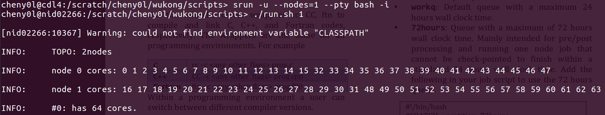
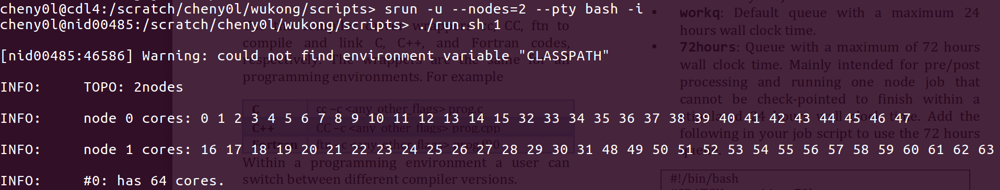
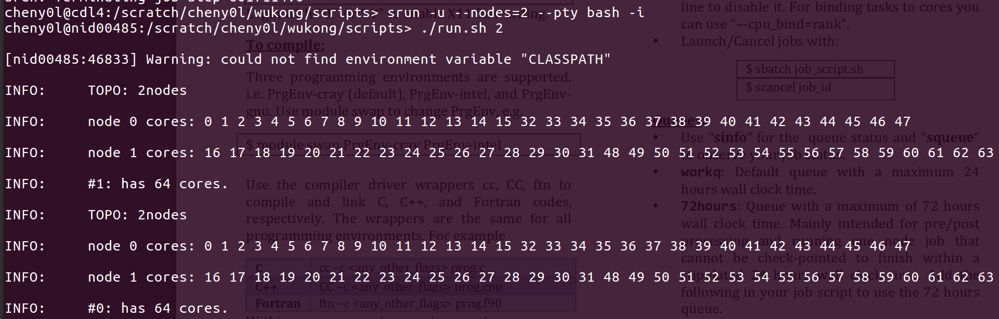
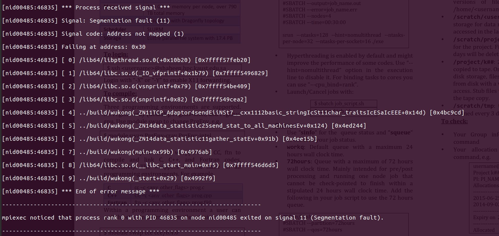
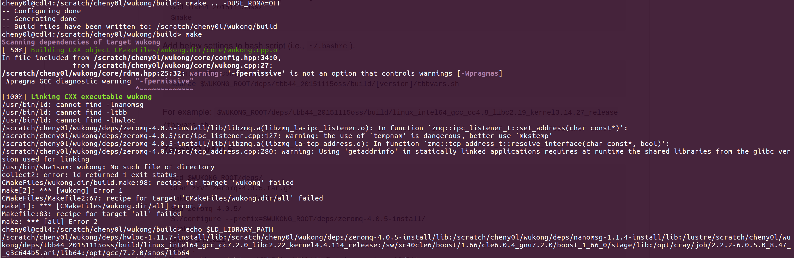

## Wukong on Shaheen

### Compile Instructions
   
   before compilation, `module swap PrgEnv-cray/6.0.4 PrgEnv-gnu`

1. set `WUKONG_ROOT`

    ```
    echo "export WUKONG_ROOT=/scratch/cheny0l/wukong" >> $HOME/.bashrc
    ```

2. install dependencies (may be slow)

    ```
    cd deps
    ./deps.sh install all
    ```

    after installation, there should be some path export commands in `$HOME/.bashrc`, just for sure, run 

    ```source $HOME/.bashrc```

3. change CMakeLists.txt, add some include paths

    ```
    ## added by me to find header files
    include_directories(deps/tbb44_20151115oss/include)
    include_directories(deps/zeromq-4.0.5-install/include)
    ```

4. an error about `_mm_pause()` not declared in `core/rdma_adaptor.hpp` line 112, add one line in this file

    ```#include <xmmintrin.h>```

5. local machine can compile smoothly now, but shaheen complains about `ld : can't find -lnanomsg`, 
shaheen doesn't install static library for `nanomsg`, I re-installed but it doesn't work. 
so I copied my local static library to shaheen 

    ```
    ## local
    cd deps/nanomsg-1.1.4-install
    scp lib.zip cheny0l@shaheen.hpc.kaust.edu.sa:/scratch/cheny0l/wukong/deps/nanomsg-1.1.4-install
    
    ## shaheen
    cd /deps/nanomsg-1.1.4-install
    unzip lib.zip
    ```
    
6. shaheen doesn't have `libibverbs.a`, only has dynamic library, I copied it from local machine

    ```
    scp /usr/lib/libibverbs.a cheny0l@shaheen.hpc.kaust.edu.sa:/scratch/cheny0l/wukong/deps/libs
    ```
    
    then link it to the target 
    
    ```
    ## target_link_libraries(wukong nanomsg zmq rt ibverbs tbb hwloc ${BOOST_LIB}/libboost_mpi.a ${BOOST_LIB}/libboost_serialization.a ${BOOST_LIB}/libboost_program_options.a)
    target_link_libraries(wukong nanomsg zmq rt tbb hwloc ${ROOT}/deps/libs/libibverbs.a ${BOOST_LIB}/libboost_mpi.a ${BOOST_LIB}/libboost_serialization.a ${BOOST_LIB}/libboost_program_options.a)
    ```

7. Finally I got some `undefined reference error` about boost, the solution is re-install boost under `deps`

### Exploration on Shaheen

1. request 1 node, run with 1 "node"



2. request 2 nodes, run with 1 "node"



3. request 2 nodes, run with 2 "nodes"





### Re-compile on shaheen

1. clear env variables in `~/.bashrc`

    remove wukong folder
    
    `cd scratch/cheny0l && git clone https://github.com/SJTU-IPADS/wukong`
    
2. load essential libraries

    ```
    module swap PrgEnv-cray/6.0.4 PrgEnv-gnu
    module load openmpi/1.10.6
    module load boost
    
    module show boost
    ```
    
3. change `CMakeLists.txt`

    ```
    ## mpi
    # set(CMAKE_CXX_COMPILER ${ROOT}/deps/openmpi-1.6.5-install/bin/mpic++)
    set(CMAKE_CXX_COMPILER CC)
    
    ## boost
    #set(BOOST_LIB "${ROOT}/deps/boost_1_67_0-install/lib")
    set(BOOST_LIB "/sw/xc40cle6/boost/1.66/cle6.0.4_gnu7.2.0/lib")
    
    # include_directories(deps/boost_1_67_0-install/include)
    include_directories(/sw/xc40cle6/boost/1.66/cle6.0.4_gnu7.2.0/include)
    ```
    
4. install dependencies

- tbb

    ```
    cd deps
    ./deps.sh install tbb
    ```

- hwloc

    ```
    ./deps.sh install hwloc
    ```
    
- nanomsg

    ```
    ./deps.sh install nanomsg
    ```
    
- zeromq

    ```
    ./deps.sh install zeromq
    ```
    
    after installation, run 

    ```
    source ~/.bashrc
    ```
 
5. cmake and make

- error1 

    ```
    In file included from /scratch/cheny0l/wukong/core/dgraph.hpp:42:0,
                     from /scratch/cheny0l/wukong/core/wukong.cpp:31:
    /scratch/cheny0l/wukong/core/gstore.hpp:31:10: fatal error: tbb/concurrent_hash_map.h: No such file or directory
     #include <tbb/concurrent_hash_map.h>
              ^~~~~~~~~~~~~~~~~~~~~~~~~~~
    ```
    
    solution :
    
    ```
    source $WUKONG_ROOT/deps/tbb44_20151115oss/build/linux_intel64_gcc_cc7.2.0_libc2.22_kernel4.4.114_release/tbbvars.sh
    ```

- error2 

    ```
    In file included from /scratch/cheny0l/wukong/core/adaptor.hpp:28:0,
                     from /scratch/cheny0l/wukong/core/engine.hpp:33,
                     from /scratch/cheny0l/wukong/core/wukong.cpp:32:
    /scratch/cheny0l/wukong/core/rdma_adaptor.hpp: In member function 'std::__cxx11::string RDMA_Adaptor::fetch(int, int)':
    /scratch/cheny0l/wukong/core/rdma_adaptor.hpp:112:13: error: '_mm_pause' was not declared in this scope
                 _mm_pause();
                 ^~~~~~~~~
    /scratch/cheny0l/wukong/core/rdma_adaptor.hpp:112:13: note: suggested alternative: 'SYS_pause'
                 _mm_pause();
                 ^~~~~~~~~
                 SYS_pause
    ```
    
    solution : add following line to `core/rdma_adaptor.hpp`
    
    ```
    #include <xmmintrin.h>
    ```
    
- error3

    ```
    /usr/bin/ld: cannot find -lnanomsg
    /usr/bin/ld: cannot find -libverbs
    /usr/bin/ld: cannot find -ltbb
    /usr/bin/ld: cannot find -lhwloc
    ```
    
    solution for -libverbs:
    
    ```
    scp /usr/lib/libibverbs.a cheny0l@shaheen.hpc.kaust.edu.sa:/scratch/cheny0l/wukong/deps/libs
    ```
    
    ```
    #target_link_libraries(wukong nanomsg zmq rt ibverbs tbb hwloc ${BOOST_LIB}/libboost_mpi.a ${BOOST_LIB}/libboost_serialization.a ${BOOST_LIB}/libboost_program_options.a)    
    target_link_libraries(wukong nanomsg zmq rt tbb hwloc ${ROOT}/deps/libs/libibverbs.a ${BOOST_LIB}/libboost_mpi.a ${BOOST_LIB}/libboost_serialization.a ${BOOST_LIB}/libboost_program_options.a)
    ```
     
### 2 versions of WUKONG

#### 1. all local libraries (/scratch/cheny0l/rdf_systems/wukong)

system preparation :

    ```
    module swap PrgEnv-cray/6.0.4 PrgEnv-gnu
    ```


#### 2. use system mpi and boost (/scratch/cheny0l/wukong)

system preparation :

    ```
    module swap PrgEnv-cray/6.0.4 PrgEnv-gnu
    nodule load openmpi/1.10.6
    module load boost
    ```
    


I think they need exact version of dependencies, other versions are not supported.

### run with `salloc`

```
export LD_LIBRARY_PATH=/scratch/cheny0l/rdf_systems/wukong/deps/openmpi-1.6.5-install/lib:/scratch/cheny0l/rdf_systems/wukong/deps/zeromq-4.0.5-install/lib:/scratch/cheny0l/rdf_systems/wukong/deps/tbb44_20151115oss/build/linux_intel64_gcc_cc7.2.0_libc2.22_kernel4.4.114_release/:/scratch/cheny0l/rdf_systems/wukong/deps/boost_1_67_0-install/lib:/scratch/cheny0l/rdf_systems/wukong/deps/nanomsg-1.1.4-install/lib:$LD_LIBRARY_PATH


export PATH=/scratch/cheny0l/rdf_systems/wukong/deps/openmpi-1.6.5-install/bin:$PATH
```

```
mpiexec -x CLASSPATH -x LD_LIBRARY_PATH -n 1 ../build/wukong config mpd.hosts -c 'sparql -f sparql_query/lubm/lubm_q7 -n 5'
```

### successful run

```
# allocate 2 tasks
salloc -n 2

export LD_LIBRARY_PATH=/scratch/cheny0l/rdf_systems/wukong/deps/openmpi-1.6.5-install/lib:/scratch/cheny0l/rdf_systems/wukong/deps/zeromq-4.0.5-install/lib:/scratch/cheny0l/rdf_systems/wukong/deps/tbb44_20151115oss/build/linux_intel64_gcc_cc7.2.0_libc2.22_kernel4.4.114_release/:/scratch/cheny0l/rdf_systems/wukong/deps/boost_1_67_0-install/lib:/scratch/cheny0l/rdf_systems/wukong/deps/nanomsg-1.1.4-install/lib:$LD_LIBRARY_PATH

export PATH=/scratch/cheny0l/rdf_systems/wukong/deps/openmpi-1.6.5-install/bin:$PATH

# edit mpd.hosts file (2 lines, same content)

mpiexec -x LD_LIBRARY_PATH -hostfile mpd.hosts -n 2 ../build/wukong config mpd.hosts -c "sparql -f sparql_query/lubm/lubm_q7 -n 5"
```

results :

```
cheny0l@gateway2:/scratch/cheny0l/rdf_systems/wukong/scripts> echo "nid00114" > mpd.hosts 
cheny0l@gateway2:/scratch/cheny0l/rdf_systems/wukong/scripts> echo "nid00114" >> mpd.hosts 
cheny0l@gateway2:/scratch/cheny0l/rdf_systems/wukong/scripts> mpiexec -x LD_LIBRARY_PATH -hostfile mpd.hosts -n 2 ../build/wukong config mpd.hosts -c "sparql -f sparql_query/lubm/lubm_q7 -n 5" 
INFO:     TOPO: 2nodes
INFO:     node 0 cores: 0 1 2 3 4 5 6 7 8 9 10 11 12 13 14 15 32 33 34 35 36 37 38 39 40 41 42 43 44 45 46 47 
INFO:     node 1 cores: 16 17 18 19 20 21 22 23 24 25 26 27 28 29 30 31 48 49 50 51 52 53 54 55 56 57 58 59 60 61 62 63 
INFO:     #0: has 64 cores.
INFO:     TOPO: 2nodes
INFO:     node 0 cores: 0 1 2 3 4 5 6 7 8 9 10 11 12 13 14 15 32 33 34 35 36 37 38 39 40 41 42 43 44 45 46 47 
INFO:     node 1 cores: 16 17 18 19 20 21 22 23 24 25 26 27 28 29 30 31 48 49 50 51 52 53 54 55 56 57 58 59 60 61 62 63 
INFO:     #1: has 64 cores.
INFO:     #1: allocate 20GB memory
INFO:     This system is compiled without RDMA support.
INFO:     loading ID-mapping file: /scratch/cheny0l/wukong_data/id_lubm_2/str_index
INFO:     loading ID-mapping (attribute) file: /scratch/cheny0l/wukong_data/id_lubm_2/str_attr_index
INFO:     loading ID-mapping file: /scratch/cheny0l/wukong_data/id_lubm_2/str_normal
INFO:     #0: allocate 20GB memory
INFO:     This system is compiled without RDMA support.
INFO:     loading ID-mapping file: /scratch/cheny0l/wukong_data/id_lubm_2/str_index
INFO:     loading ID-mapping (attribute) file: /scratch/cheny0l/wukong_data/id_lubm_2/str_attr_index
INFO:     loading ID-mapping file: /scratch/cheny0l/wukong_data/id_lubm_2/str_normal
INFO:     loading string server is finished (107 ms)
INFO:     loading string server is finished (166 ms)
INFO:     gstore = 21474836480 bytes 
INFO:           header region: 765041049 slots (main = 50331653, indirect = 45298478)
INFO:           entry region: 2308544921 entries
INFO:     2 files and 2 attributed files found in directory (/scratch/cheny0l/wukong_data/id_lubm_2/) at server 0
INFO:     gstore = 21474836480 bytes 
INFO:           header region: 765041049 slots (main = 50331653, indirect = 45298478)
INFO:           entry region: 2308544921 entries
INFO:     2 files and 2 attributed files found in directory (/scratch/cheny0l/wukong_data/id_lubm_2/) at server 1
INFO:     #1: 98 ms for loading data files
INFO:     #0: 100 ms for loading data files
INFO:     already aggregrate 5%
INFO:     already aggregrate 5%
INFO:     already aggregrate 10%
INFO:     already aggregrate 10%
INFO:     already aggregrate 15%
INFO:     already aggregrate 15%
INFO:     already aggregrate 20%
INFO:     already aggregrate 20%
INFO:     already aggregrate 25%
INFO:     already aggregrate 25%
INFO:     already aggregrate 30%
INFO:     already aggregrate 30%
INFO:     already aggregrate 35%
INFO:     already aggregrate 35%
INFO:     already aggregrate 40%
INFO:     already aggregrate 40%
INFO:     already aggregrate 45%
INFO:     already aggregrate 45%
INFO:     already aggregrate 50%
INFO:     already aggregrate 50%
INFO:     already aggregrate 55%
INFO:     already aggregrate 60%
INFO:     already aggregrate 55%
INFO:     already aggregrate 65%
INFO:     already aggregrate 60%
INFO:     already aggregrate 65%
INFO:     already aggregrate 70%
INFO:     already aggregrate 70%
INFO:     already aggregrate 75%
INFO:     already aggregrate 75%
INFO:     already aggregrate 80%
INFO:     already aggregrate 80%
INFO:     already aggregrate 85%
INFO:     already aggregrate 85%
INFO:     already aggregrate 90%
INFO:     already aggregrate 90%
INFO:     already aggregrate 95%
INFO:     already aggregrate 95%
INFO:     already aggregrate 100%
INFO:     #0: 34 ms for aggregrating triples
INFO:     #1: 36 ms for aggregrating triples
INFO:     #0: 2 ms for loading attribute files
INFO:     #1: 0 ms for loading attribute files
INFO:     #1: 28ms for inserting normal data into gstore
INFO:     #1: 0ms for inserting attributes into gstore
INFO:      start (parallel) prepare index info 
INFO:     #0: 28ms for inserting normal data into gstore
INFO:     #0: 0ms for inserting attributes into gstore
INFO:      start (parallel) prepare index info 
INFO:     #1: 285ms for inserting index data into gstore
INFO:     #1: loading DGraph is finished
INFO:     #0: 293ms for inserting index data into gstore
INFO:     #0: loading DGraph is finished
INFO:     main header: 6144 MB (402653224 slots)
INFO:     	used: 0.0274951 % (110710 slots)
INFO:     	chain: 12.5 % (50331653 slots)
INFO:     indirect header: 5529.6 MB (362387824 slots)
INFO:     	alloced: 0 % (0 buckets)
INFO:     	used: 0 % (0 slots)
INFO:     entry: 8806.4 MB (2308544921 entries)
INFO:     	used: 0.0152603 % (352290 entries)
INFO:     #vertices: 0
INFO:     #predicates: 0
INFO:     main header: 6144 MB (402653224 slots)
INFO:     	used: 0.0271981 % (109514 slots)
INFO:     	chain: 12.5 % (50331653 slots)
INFO:     indirect header: 5529.6 MB (362387824 slots)
INFO:     	alloced: 0 % (0 buckets)
INFO:     	used: 0 % (0 slots)
INFO:     entry: 8806.4 MB (2308544921 entries)
INFO:     	used: 0.0161209 % (372158 entries)
INFO:     #vertices: 0
INFO:     #predicates: 0
INFO:     #1: generating stats is finished.
INFO:     #0: generating stats is finished.
INFO:     global_ptcount size: 32
INFO:     global_pscount size: 33
INFO:     global_pocount size: 32
INFO:     global_ppcount size: 545
INFO:     global_tyscount size: 15
INFO:     #0: load stats of DGraph is finished.
INFO:     #1: load stats of DGraph is finished.

Input 'help' command to get more information

INFO:     Run one-shot command: sparql -f sparql_query/lubm/lubm_q7 -n 5
INFO:     Parsing a SPARQL query is done.
INFO:     Parsing time: 16407 usec
INFO:     Planning time: 127 usec
INFO:     The query starts from an index vertex, you could use option -m to accelerate it.
INFO:     The query starts from an index vertex, you could use option -m to accelerate it.
INFO:     The query starts from an index vertex, you could use option -m to accelerate it.
INFO:     The query starts from an index vertex, you could use option -m to accelerate it.
INFO:     The query starts from an index vertex, you could use option -m to accelerate it.
INFO:     (average) latency: 165321 usec
INFO:     (last) result size: 73
INFO:     Done
--------------------------------------------------------------------------
mpiexec has exited due to process rank 1 with PID 5509 on
node nid00114 exiting improperly. There are two reasons this could occur:

1. this process did not call "init" before exiting, but others in
the job did. This can cause a job to hang indefinitely while it waits
for all processes to call "init". By rule, if one process calls "init",
then ALL processes must call "init" prior to termination.

2. this process called "init", but exited without calling "finalize".
By rule, all processes that call "init" MUST call "finalize" prior to
exiting or it will be considered an "abnormal termination"

This may have caused other processes in the application to be
terminated by signals sent by mpiexec (as reported here).
--------------------------------------------------------------------------
```

allocate 2 nodes :

```
salloc --nodes 2

export LD_LIBRARY_PATH=/scratch/cheny0l/rdf_systems/wukong/deps/openmpi-1.6.5-install/lib:/scratch/cheny0l/rdf_systems/wukong/deps/zeromq-4.0.5-install/lib:/scratch/cheny0l/rdf_systems/wukong/deps/tbb44_20151115oss/build/linux_intel64_gcc_cc7.2.0_libc2.22_kernel4.4.114_release/:/scratch/cheny0l/rdf_systems/wukong/deps/boost_1_67_0-install/lib:/scratch/cheny0l/rdf_systems/wukong/deps/nanomsg-1.1.4-install/lib:$LD_LIBRARY_PATH

export PATH=/scratch/cheny0l/rdf_systems/wukong/deps/openmpi-1.6.5-install/bin:$PATH

# edit mpd.hosts (2 lines, different)

mpiexec -x LD_LIBRARY_PATH -hostfile mpd.hosts -n 2 ../build/wukong config mpd.hosts -c "sparql -f sparql_query/lubm/lubm_q7 -n 5"
```

stuck after loading, (use same node in mpd.hosts, then fine, use two nodes, stuck)

```
cheny0l@gateway2:/scratch/cheny0l/rdf_systems/wukong/scripts> mpiexec -x LD_LIBRARY_PATH -hostfile mpd.hosts -n 2 ../build/wukong config mpd.hosts -c "sparql -f sparql_query/lubm/lubm_q7 -n 5"
INFO:     TOPO: 2nodes
INFO:     node 0 cores: 0 1 2 3 4 5 6 7 8 9 10 11 12 13 14 15 32 33 34 35 36 37 38 39 40 41 42 43 44 45 46 47 
INFO:     node 1 cores: 16 17 18 19 20 21 22 23 24 25 26 27 28 29 30 31 48 49 50 51 52 53 54 55 56 57 58 59 60 61 62 63 
INFO:     #1: has 64 cores.
INFO:     TOPO: 2nodes
INFO:     node 0 cores: 0 1 2 3 4 5 6 7 8 9 10 11 12 13 14 15 32 33 34 35 36 37 38 39 40 41 42 43 44 45 46 47 
INFO:     node 1 cores: 16 17 18 19 20 21 22 23 24 25 26 27 28 29 30 31 48 49 50 51 52 53 54 55 56 57 58 59 60 61 62 63 
INFO:     #0: has 64 cores.
INFO:     #1: allocate 20GB memory
INFO:     This system is compiled without RDMA support.
INFO:     #0: allocate 20GB memory
INFO:     This system is compiled without RDMA support.
INFO:     loading ID-mapping file: /scratch/cheny0l/wukong_data/id_lubm_2/str_index
INFO:     loading ID-mapping file: /scratch/cheny0l/wukong_data/id_lubm_2/str_index
INFO:     loading ID-mapping (attribute) file: /scratch/cheny0l/wukong_data/id_lubm_2/str_attr_index
INFO:     loading ID-mapping (attribute) file: /scratch/cheny0l/wukong_data/id_lubm_2/str_attr_index
INFO:     loading ID-mapping file: /scratch/cheny0l/wukong_data/id_lubm_2/str_normal
INFO:     loading ID-mapping file: /scratch/cheny0l/wukong_data/id_lubm_2/str_normal
INFO:     loading string server is finished (172 ms)
INFO:     loading string server is finished (173 ms)
INFO:     gstore = 21474836480 bytes 
INFO:           header region: 765041049 slots (main = 50331653, indirect = 45298478)
INFO:           entry region: 2308544921 entries
INFO:     2 files and 2 attributed files found in directory (/scratch/cheny0l/wukong_data/id_lubm_2/) at server 0
INFO:     gstore = 21474836480 bytes 
INFO:           header region: 765041049 slots (main = 50331653, indirect = 45298478)
INFO:           entry region: 2308544921 entries
INFO:     2 files and 2 attributed files found in directory (/scratch/cheny0l/wukong_data/id_lubm_2/) at server 1
INFO:     #0: 292 ms for loading data files
INFO:     already aggregrate 5%
INFO:     already aggregrate 10%
INFO:     #1: 293 ms for loading data files
INFO:     already aggregrate 15%
INFO:     already aggregrate 20%
INFO:     already aggregrate 5%
INFO:     already aggregrate 25%
INFO:     already aggregrate 10%
INFO:     already aggregrate 30%
INFO:     already aggregrate 15%
INFO:     already aggregrate 35%
INFO:     already aggregrate 20%
INFO:     already aggregrate 40%
INFO:     already aggregrate 25%
INFO:     already aggregrate 45%
INFO:     already aggregrate 30%
INFO:     already aggregrate 35%
INFO:     already aggregrate 50%
INFO:     already aggregrate 55%
INFO:     already aggregrate 40%
INFO:     already aggregrate 60%
INFO:     already aggregrate 45%
INFO:     already aggregrate 65%
INFO:     already aggregrate 50%
INFO:     already aggregrate 55%
INFO:     already aggregrate 70%
INFO:     already aggregrate 75%
INFO:     already aggregrate 60%
INFO:     already aggregrate 80%
INFO:     already aggregrate 65%
INFO:     already aggregrate 70%
INFO:     already aggregrate 75%
INFO:     already aggregrate 80%
INFO:     already aggregrate 85%
INFO:     already aggregrate 85%
INFO:     already aggregrate 90%
INFO:     already aggregrate 95%
INFO:     already aggregrate 90%
INFO:     already aggregrate 95%
INFO:     already aggregrate 100%
INFO:     #0: 34 ms for aggregrating triples
INFO:     #0: 1 ms for loading attribute files
INFO:     #1: 35 ms for aggregrating triples
INFO:     #1: 1 ms for loading attribute files
INFO:     #1: 27ms for inserting normal data into gstore
INFO:     #1: 0ms for inserting attributes into gstore
INFO:      start (parallel) prepare index info 
INFO:     #0: 27ms for inserting normal data into gstore
INFO:     #0: 0ms for inserting attributes into gstore
INFO:      start (parallel) prepare index info 
INFO:     #1: 288ms for inserting index data into gstore
INFO:     #1: loading DGraph is finished
INFO:     #0: 291ms for inserting index data into gstore
INFO:     #0: loading DGraph is finished
INFO:     main header: 6144 MB (402653224 slots)
INFO:     	used: 0.0274951 % (110710 slots)
INFO:     	chain: 12.5 % (50331653 slots)
INFO:     indirect header: 5529.6 MB (362387824 slots)
INFO:     	alloced: 0 % (0 buckets)
INFO:     	used: 0 % (0 slots)
INFO:     entry: 8806.4 MB (2308544921 entries)
INFO:     	used: 0.0152603 % (352290 entries)
INFO:     #vertices: 0
INFO:     #predicates: 0
INFO:     main header: 6144 MB (402653224 slots)
INFO:     	used: 0.0271981 % (109514 slots)
INFO:     	chain: 12.5 % (50331653 slots)
INFO:     indirect header: 5529.6 MB (362387824 slots)
INFO:     	alloced: 0 % (0 buckets)
INFO:     	used: 0 % (0 slots)
INFO:     entry: 8806.4 MB (2308544921 entries)
INFO:     	used: 0.0161209 % (372158 entries)
INFO:     #vertices: 0
INFO:     #predicates: 0
INFO:     #0: generating stats is finished.
INFO:     #1: generating stats is finished.
INFO:     global_ptcount size: 32
INFO:     global_pscount size: 33
INFO:     global_pocount size: 32
INFO:     global_ppcount size: 545
INFO:     global_tyscount size: 15
INFO:     #0: load stats of DGraph is finished.
INFO:     #1: load stats of DGraph is finished.

Input 'help' command to get more information

```

maybe the reason is :

```
[nid03448][[63332,1],1][btl_tcp_endpoint.c:655:mca_btl_tcp_endpoint_complete_connect] connect() to 10.129.35.93 failed: Connection refused (111)
```

allocate 16 tasks, then run -n 16, mpi crashed, change to 6, fine.

